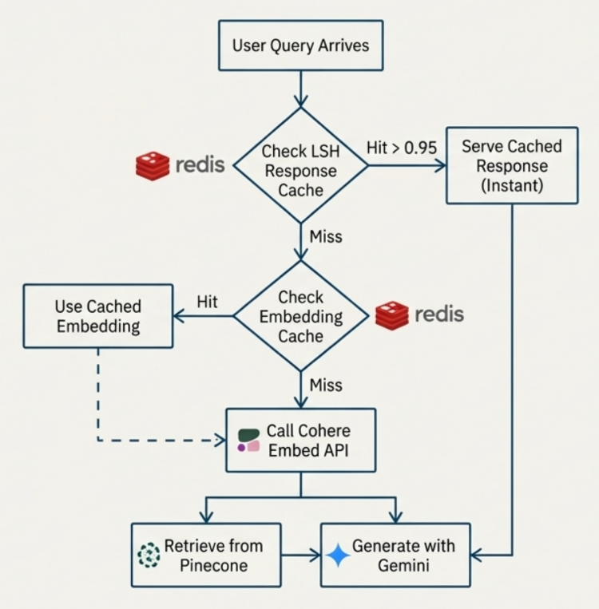
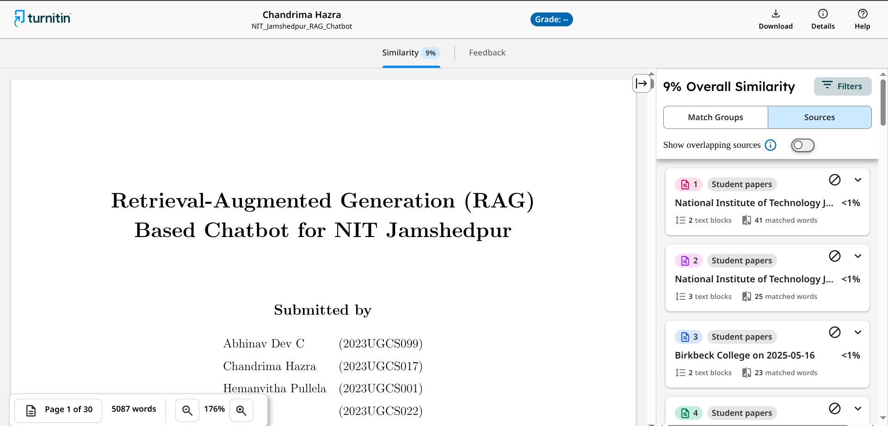
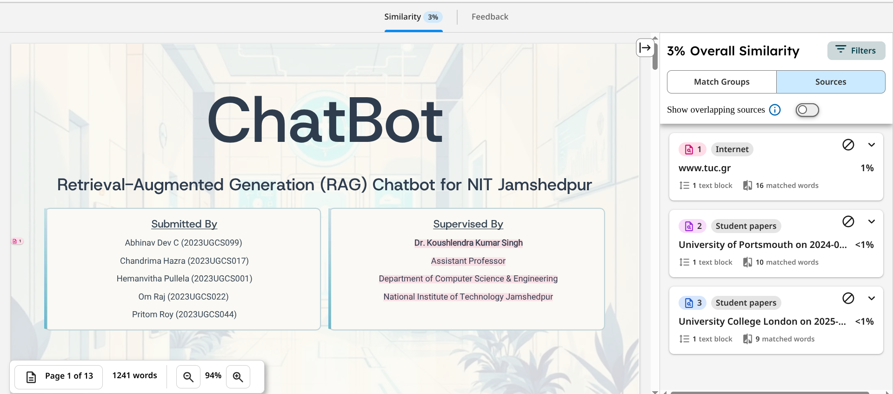

# Chatbot for NIT Jamshedpur

AI assistant that answers questions about NIT Jamshedpur using Retrieval‑Augmented Generation (RAG). It crawls the official website, extracts and embeds content, and serves accurate, source‑grounded answers with relevant links and streaming responses.

## Overview

**What's going in inside**

- RAG: scraper → embedding → vector search → streaming answers
- Scrape the site with Puppeteer, collect rich page content and PDF links, and persist snapshots in json format under `scraped_data/`.
- Chunk and embed with Cohere; store semantic vectors in Pinecone.
- Maintain a change ledger in MongoDB (per URL content hash) to avoid duplicate work and to safely delete stale vectors.
- Serve chat with Cohere.
- Cache heavy work: embedding cache and a semantic response cache using LSH (Redis‑backed or in‑memory fallback).
- Enforce rate limits per session/IP + menory fallback using Redis.


## Architecture

- Scraper: Puppeteer + Axios with sitemap awareness, categorized page discovery, dynamic JSON/XHR parsing and PDF link extraction.
- Embeddings: Cohere v3 (`1024`‑dim) via LangChain.
- Vector Store: Pinecone (cosine similarity, dimension 1024).
- Generation: Cohere (`command-r-plus`) with structured prompt and context window from vector search.
- Change Ledger: MongoDB collections `pages` and `chunks` track content hashes, chunk IDs, and versions.
- Caches:
  - Embedding cache (`caching/embeddingCache.js`) — Redis or in‑memory LRU
  - Response cache (`caching/responseCache.js`) — LSH over embeddings to reuse similar answers
- API & Streaming: Express with SSE on `/chat-stream`, plus admin endpoints for scraping/embedding/health.
- Rate Limiting: Redis‑based limiter with memory fallback.


## Tech Stack

- Node.js, Express
- Cohere AI (Chat & Embeddings)
- Pinecone Vector Database
- MongoDB (change ledger)
- Redis for caching and rate limiting
- Puppeteer (scraper), Axios, Cheerio‑style parsing (via DOM evaluation)
- Frontend: simple HTML/CSS/JS served from `public/` for testing responses from the chatbot


## Repository Layout

- `server.js` — Express server
- `routes/` — Routes for authentication, scraping, embedding and chatting
- `config/` — contains authorization middlware and fucntions for connecting to DB
- `rag-system/RagSystem.js` — RAG core (init, retrieval, streaming chat, ledger ingestion)
- `scraper/scraper.js` — Puppeteer scraper with sitemap and PDF policy
- `scraper/processPdfs.js` — PDF processing helpers
- `caching/` — embedding and response caches, normalization, and chat history
- `rate-limiting/rateLimiter.js` — per‑session/IP limiter (Redis/memory)
- `scripts/` — CLI flows for `scrape`, `embed`, `serve`
- `public/` — chat UI and admin login/dashboard pages
- `scraped_data/` — persisted scrape snapshots (JSON)


## Data Flow

**1) Discovery & Scrape**
  - Sitemap‑aware crawler discovers section pages and recent tender/notice PDFs.
  - JSON/XHR responses are inspected to capture PDFs linked indirectly.

**2) Ingestion & Embedding**
  - Text is split into overlapping chunks (LangChain splitter).
  - Cohere embeddings (v3, 1024‑dim) are computed with a cache.
  - Pinecone upserts chunks; Mongo ledger tracks content hashes and versions.
  - Stale chunks are pruned safely using the ledger plan.

**3) Query & Generation**
  - For each user question, top‑K chunks are retrieved from Pinecone.
  - A structured prompt is sent to Cohere; response is streamed via SSE.
  - Response cache can short‑circuit if a highly similar question was answered recently.





## For setting up locally

### Prerequisites

- **Node.js 18+** (the stack uses ES Modules and Puppeteer's bundled Chromium build).
- **npm** (installs dependencies and runs scripts).
- Accounts and API keys for:
  - Cohere AI (`COHERE_API_KEY`)
  - Pinecone vector database (`PINECONE_API_KEY`, index name, environment)
- **MongoDB** connection string (Atlas or self-hosted) if you want incremental ingestion and change tracking. Without it, the pipeline falls back to a legacy upsert path.
- **Redis** (local or remote) if you want persistent caches. A local instance is enough for development; see `./docker-compose.yml`.

### OCR Setup (Required for scanned PDFs)
If you need to process scanned PDFs (that contain images of text instead of selectable text), you must install **Poppler** so the system can convert PDF pages to images for the OCR engine.

We have provided a helper script to install this automatically on Windows:

1. Open PowerShell as Administrator.
2. Run the following command from the project root:
   ```powershell
   powershell -ExecutionPolicy Bypass -File scripts/install_poppler.ps1
   ```
   This will download portable Poppler binaries and place them in `scraper/bin/`, where the scraper will look for them.

*(Note: The OCR engine itself uses `tesseract.js` which is bundled with the project, so no separate Tesseract installation is needed.)*


### Initial setup

1. **Install dependencies**
   ```bash
   npm install
   ```
   
2. **Create `.env`** (never commit real keys). At minimum:
   ```env
   # AI providers
   COHERE_API_KEY=your_cohere_key
   COHERE_CHAT_MODEL=command-r-plus        # optional override
   COHERE_EMBED_MODEL=embed-english-v3.0   # optional override

   # Pinecone
   PINECONE_API_KEY=your_pinecone_key
   PINECONE_INDEX_NAME=nitjsr-rag
   PINECONE_ENVIRONMENT=us-east-1

   # Server
   PORT=3000
   AUTO_INIT=true
   INIT_SKIP_EMBED_IF_INDEX_NOT_EMPTY=true

   # mongo & redis
   REDIS_URL=redis://localhost:6379/0
   MONGODB_URI=...
   MONGODB_DB=jharkhand_gscc_rag
   MONGO_PAGES_COLL=pages
   MONGO_CHUNKS_COLL=chunks

   # admin credentials
   JWT_SECRET=...
   ADMIN_PASSWORD=...
   ADMIN_USERNAME=...
   ADMIN_PASSWORD_HASH=...(generate a hash using the ADMIN_PASSWORD)
    
   ```
      
4. **Start supporting services (optional)**
   - Redis: `docker compose up -d redis`
   - MongoDB: point `MONGODB_URI` to Atlas or run a local instance.

5. **Since the scraping and embedding routes are protected, you need to login as admin to access them**
   - Fill the admin credentials in the .env
   - Open `https://localhost:3000/admin/login` and login using your credentials.
   - After succesfully logging in, you can access the APIs. You'll see an adminToken in the localStorage which may come to your use.
  
   NOTE: You can also login by sending a cURL request:
   ```bash
   curl -X POST http://localhost:3000/auth/login \
    -H "Content-Type: application/json" \
    -d '{
      "username": "admin",
      "password": "yourpassword"
    }'
    ```
   - After succesfully logging in, you'll receive a token in the response which can be used to access to the other APIs.
     
7. **(One-time) fetch a sample PDF for pdf-parse (if Puppeteer struggles without it)**
   ```bash
   mkdir -p test/data
   curl -L "https://www.w3.org/WAI/ER/tests/xhtml/testfiles/resources/pdf/dummy.pdf" \
     -o "test/data/05-versions-space.pdf"
   ```


### Workflow

You may either run the scripts or directly send a cURL request:

**If you use cURL:**

1. **Scrape + Embed**

Triggers the complete scraping pipeline and embeds the scraped content.

```bash
curl -X POST http://localhost:3001/scrape-and-embed \
  -b "adminToken=..." \
  -H "Content-Type: application/json" \
  -d '{
    "url": "https://www.nitjsr.ac.in/"
  }'
```

2. **Embed Latest Only**

Embeds the most recently scraped or processed data.

```bash
curl -X POST http://localhost:3001/embed-latest \
  -b "adminToken=..." \
  -H "Content-Type: application/json" \
  -d '{
    "url": "https://www.nitjsr.ac.in/"
  }'
```

3. **Run**
   ```bash
     node scraper/processPdfs.js
   ```
   
   this will process all the PDFs, so for this you'll require tesseract for paring PDFs.

---

**Or, if you prefer running scripts instead:**

1. **Scrape the website**
   ```bash
   npm run scrape -- --maxPages 100 --maxDepth 3 --delay 1500
   ```
   This creates `scraped_data/nitjsr_enhanced_comprehensive_<timestamp>.json`. Logs show page counts, PDFs found, and category splits.

2. **Embed into Pinecone**
   ```bash
   npm run embed -- --latest
   # or, to target a specific file:
   npm run embed -- --file scraped_data/<file>.json
   # add --force to wipe the Pinecone index first
   ```
   When MongoDB is configured the ingestion path writes a ledger of pages and chunks and removes stale vectors automatically.

3. **Serve the chatbot**
   - Development (nodemon + auto-init): `npm run dev`
   - Production style (single start + auto-init): `npm start`
   - Serve-only, no auto init (useful if vectors are already in Pinecone): `npm run serve`

   The server listens on `http://localhost:PORT` (3000 by default). The web UI and REST API share the same origin. If `AUTO_INIT=true`, startup runs `initializeSystem()` which pulls the latest scrape and embeds it unless Pinecone already has vectors and `INIT_SKIP_EMBED_IF_INDEX_NOT_EMPTY` is true.

4. **Chat / monitor**
   - Visit `http://localhost:PORT/` for the UI.
   - Hit REST endpoints (see below) for health, stats, and manual control.


## API endpoints (served from ./routes/)
- `GET /health` -> readiness info, cache stats, Pinecone totals, Mongo status.
- `POST /initialize` -> validates env vars, loads the latest scrape (or creates a new one), embeds, and marks the system initialized.
- `POST /embed-latest` -> reprocesses the newest file in `scraped_data/` and pushes vectors (requires Mongo for the ledger mode).
- `POST /scrape` -> triggers a fresh scrape; `{ "force": true }` clears Pinecone first.
- `POST /scrape-and-embed` -> the api is self-explanatory
- `POST /chat` -> `{ "question": "..." }` returns an answer, sources, and relevant links; uses the response cache when available.
- `GET /stats` -> aggregates Pinecone, Mongo, and scrape file counts.
- `GET /reindex/preview` -> dry-run of the ledger ingestion that reports adds, updates, and deletes without touching Pinecone.
- `GET /sources` -> list of saved scrape bundles with counts and categories.
- `GET /links` -> flattened view of the link database (PDFs, internal pages) once the system is initialized.
- `GET /test-cohere` / `GET /test-pinecone` -> connectivity probes for external services.


## npm scripts and utilities
- `npm run scrape` -> launches `scripts/scrape.js`; accepts `--maxPages`, `--maxDepth`, `--delay`.
- `npm run embed` -> runs `scripts/embed.js`; accepts `--latest`, `--file`, `--force`.
- `npm run serve` -> starts the server with `AUTO_INIT=false` via `scripts/serve.js`.
- `npm run dev` -> nodemon watch mode for `server.js`.
- `npm run test:redis-emb-cache` / `npm run inspect:redis-emb-key` -> utilities for the embedding cache.
- `node testScraper.js` -> small harness that scrapes a handful of pages and prints a verbose summary.


## Contributors (in alphabetical order)
- Abhinav Dev C
- Chandrima Hazra
- Hemanvitha Pullela
- Om Raj
- Pritom Roy


### Turnitin assessment



